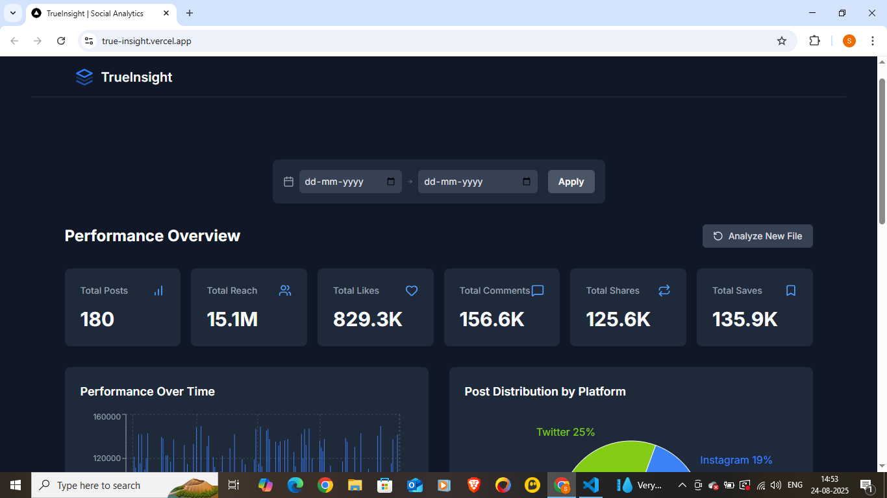

# TrueInsight Social Analytics 📊

**TrueInsight** is a client-side web application that transforms raw social media CSV data into a clean, interactive, and insightful analytics dashboard. This tool empowers users to quickly understand their content performance without needing complex software.

[](https://true-insight.vercel.app/)

**➡️ Live Demo:** [**https://true-insight.vercel.app/**](https://true-insight.vercel.app/)

---

## About The Project

In a data-driven world, content creators and social media managers need to quickly assess what's working. However, raw data exported from social platforms is often just a wall of numbers. **TrueInsight** solves this by providing an instant, in-browser solution to parse, clean, and visualize this data, revealing key performance indicators and content quality scores at a glance.

The best part? **No backend or database is required.** All processing happens directly in the user's browser, making it fast, private, and easy to use.

---

## Key Features

- **📄 In-Browser CSV Parsing:** Uses Papa Parse to efficiently handle user-uploaded CSV files of any size.
- **🧼 Robust Data Handling:** Automatically cleans data, handles missing values, and parses various date formats using `date-fns`.
- **⚙️ Advanced Error Handling:** Provides clear, user-friendly feedback for invalid file types, incorrect CSV headers, or empty files.
- **📈 Interactive Dashboard:** A full suite of components built with Recharts, including:
  - **KPI Cards** with number abbreviation for large values.
  - **Performance Over Time** bar chart (chronologically sorted).
  - **Post Distribution** pie chart.
- **🔬 Deep Analysis Tools:**
  - **Per-Platform Analysis Table** with interactive column sorting.
  - **Content Quality Metrics** like Engagement Rate, Save-to-Like Ratio, and more.
  - **Date Range Filtering** to analyze specific periods.
- **💾 Data Persistence:** Uses `localStorage` to save the last session, so the user's dashboard is there when they return.
- **📱 Fully Responsive Design:** A modern, mobile-first UI built with Tailwind CSS that looks great on all devices.

---

## Tech Stack

- **Framework:** Next.js (App Router)
- **Language:** TypeScript
- **Styling:** Tailwind CSS
- **Charting:** Recharts
- **CSV Parsing:** Papa Parse
- **Date Handling:** date-fns
- **Icons:** Lucide React

---

## Getting Started

To get a local copy up and running, follow these simple steps.

### Prerequisites

Make sure you have Node.js (v18+) and npm installed on your machine.

### Installation

1.  Clone the repo
    ```sh
    git clone [https://github.com/souvikontop/TrueInsight.git](https://github.com/souvikontop/TrueInsight.git)
    ```
2.  Navigate to the project directory
    ```sh
    cd TrueInsight
    ```
3.  Install NPM packages
    ```sh
    npm install
    ```
4.  Run the development server
    ```sh
    npm run dev
    ```
5.  Open [http://localhost:3000](http://localhost:3000) with your browser to see the result.
